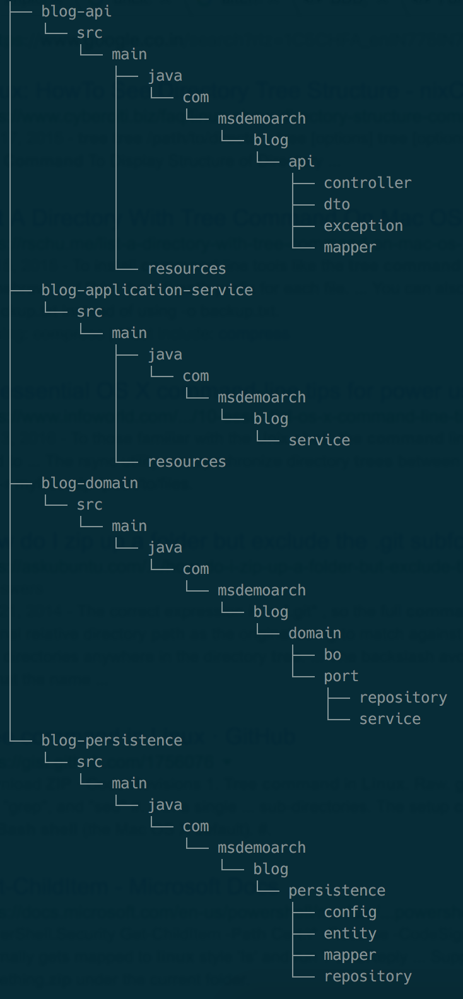

# Demo Application : Structure

## Modules

#### *Interface Adapters*

- ***blog-api***
	- Primary (or Driving) Adapters wrap around a port
	- tell the application core what to do
	- controllers, console commands, etc

- ***blog-persistence***
	- Secondary (or Driven) Adapters implement a port, an interface and are then injected into the application core
	- told by the application core what to do
	- repository, search engine, message bus, etc 

&nbsp;
#### *Application Layer* : *blog-application-service*
- Business Use cases
- Drive the application flow control to/from primary adapters, domain and secondary adapeters

&nbsp;
#### *Domain Layer* : *blog-domain*
- ***Domain***
	- data and the logic to manipulate that data that is specific to the domain
	- independent of the business processes that trigger that logic
	- completely unaware of the Application Layer
	- good location for "ports" 

- ***Ports***
	- specific entry point into the application core
	- specification of how a tool (UI, console, etc) can use the application core, or how it (database engine, etc) is used by the application core
	- for all practical purposes these are interfaces (one or several) 

&nbsp;
## Module Dependencies
(refer the gradle build files)

***blog-domain***

- the core module (innermost layer)
- it is a ***compile*** dependency for all other modules: `blog-application-service`, `blog-persistence`, `blog-api`
- it does not have any dependency on outer layers or frameworks
- independently testable

***blog-application-service***

- contains the `Main` class, **Spring Boot** jar is packaged here
- ***compile*** dependency on `blog-domain`
- ***runtime*** dependency on `blog-persistence`, `blog-api` (since these need to be packaged in the jar) 
 
***blog-api, blog-persistence*** 

- ***compile*** dependency on `blog-domain`

&nbsp;
## Data structures

***DTO (Data Transfer Object)***

  - Basic object with API layer validations (mandatory, length, etc.; probably using javax.Validation)
  - defined in `blog-api` (Along with mappers)

***BO (Business Object)***

  - Object that contains data directly tied to it and encapsulates basic operations. 
  - Follows "Tell, Don't Ask"; must not have "get" methods, the BO works on the command given to it by the Service layer
    Example: in the Service Layer
    
        instead of using    :   `if (person.getGender() == "M")` 
        use something like  :   `if (person.isMale())`
  - So it contains the core business logic around the "data/model"
  - Service layer is more of a falicitator in this scenario and deals with taking actions based on the logic encapsulated in the BO
  - defined in `blog-application-service`
  
***Entity***

  - No suffix as such
  - Persistence object
  - defined in `blog-persistence` (Along with mappers)

***Mappers***

- For converting one form of bean to another:
  
  DTO	<--->  BO
  
  BO	<--->  Entity

&nbsp;
## Reactive paradigm and Application Layering
For the application to be truly reactive, it must adhere to the reactive paradigm throughout, for instance, all I/O operations, persistence must be non-blocking.
As such the **ports** in the domain are aware of (and have a dependency) on the reactive streams library:
`com.msdemoarch.blog.domain.port.repository.PostRepository`
`com.msdemoarch.blog.domain.port.service.PostService`

This is debatable, as the current approach is a trade-off against the purist one where, we would convert from and to reactive wrappers at each interface and keep these interfaces reactive library agnostic.